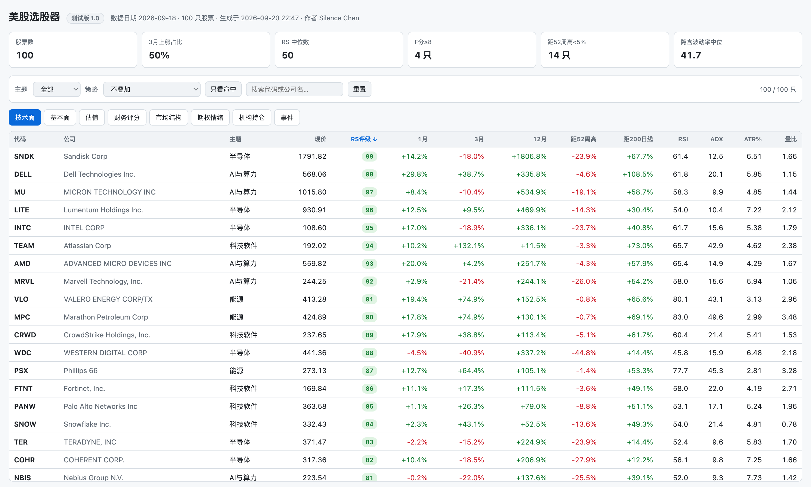
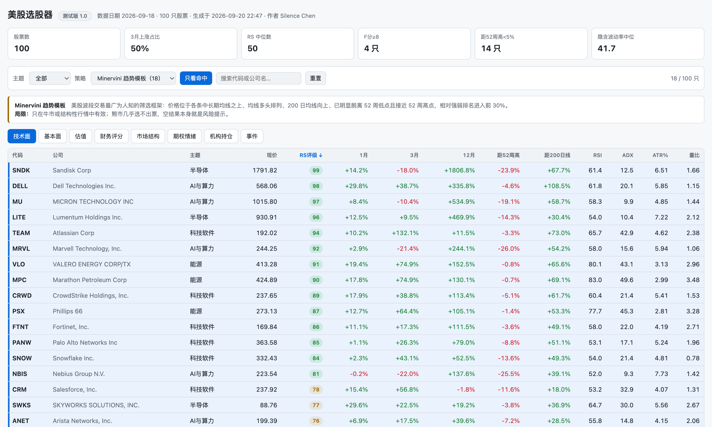
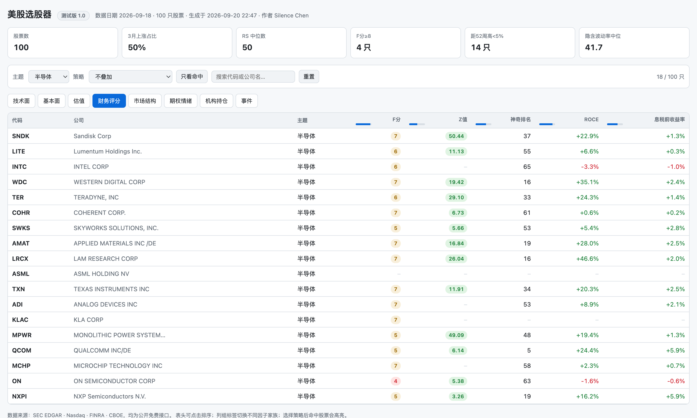

<div align="center">

# 美股选股器 · US Stock Screener

**开源美股量化筛选工具 · 数据采集 · 技术指标 · 形态识别 · 策略验证 · 可视化报告**

`测试版 1.0`　作者 **Silence Chen**

[](#)
[](https://www.python.org/)
[](LICENSE)
[](references/数据源说明.md)
[](SKILL.md)

**333 个筛选条件自由组合 · 61 种 K 线形态自动识别 · 20 个内置策略**

数据全部来自 SEC EDGAR、Nasdaq、FINRA、CBOE 等公开免费接口，**不需要任何 API Key**

</div>

---

> ⚠️ **免责声明**
> 本项目仅为**投资研究与工具分享**，所有输出不构成投资建议、买卖推荐或收益承诺。
> 美股投资存在本金损失风险。请独立决策，必要时咨询持牌专业人士。DYOR。

---

## 目录

- [它能做什么](#它能做什么)
- [效果预览](#效果预览)
- [快速开始](#快速开始)
- [使用方式](#使用方式)
- [因子体系](#因子体系)
- [内置策略](#内置策略)
- [数据源](#数据源)
- [项目结构](#项目结构)
- [设计取舍](#设计取舍)
- [已知限制](#已知限制)

---

## 它能做什么

一条完整的美股筛选工具链：

```
采集数据  →  计算因子  →  组合条件选股  →  历史验证  →  生成可视化报告
```

| 模块 | 内容 |
| --- | --- |
| 📊 **技术指标** | 70 个：MACD、KDJ、BOLL、RSI、ADX、ATR、OBV、SAR、CCI、MFI、相对强弱 RS 等 |
| 🕯️ **K 线形态** | 61 种：锤头、晨星、吞没、三只乌鸦……全中文命名，标注可靠度 |
| 🔍 **筛选条件** | 333 个，分 19 类，可任意与/或组合 |
| 📈 **内置策略** | 20 个，分趋势动量 / 质量价值 / 事件结构 / 防御反转四类 |
| 💰 **基本面** | SEC EDGAR 官方财报：营收增速、利润率、ROE、FCF、估值倍数 |
| 🏆 **财务评分** | Piotroski F-Score、Altman Z-Score、Greenblatt 神奇公式 |
| 🏦 **机构持仓** | SEC Form 13F：持有机构家数、机构持股占比 |
| 🎯 **期权情绪** | CBOE 期权链：隐含波动率、认沽认购比、波动率偏斜、期权异动 |
| 🩳 **市场结构** | FINRA 每日做空量，识别做空占比异常 |
| 📅 **事件与预期** | 财报日历、财报后漂移窗口、分析师目标价空间 |
| 🖥️ **可视化报告** | 单文件交互式网页，可排序、筛选、叠加策略 |
| ⏮️ **历史验证** | 选股有效性检验，输出超额收益与胜率 |

项目可以两种方式使用：

- **作为 Claude Skill**：把仓库放进技能目录，用自然语言选股
- **作为命令行工具**：每个脚本都能独立运行，也可在 Python 里调用

---

## 效果预览

### 全因素总览

一页看完所有股票的技术面、基本面、估值、评分、期权、机构持仓。
表头可点击排序，右上角显示筛选后的数量。



### 叠加策略：命中股票高亮

从下拉选择任一内置策略（括号内是命中数量），页面会高亮命中的股票，
并在上方显示该策略的**逻辑**与**局限**——避免只看到名单就下单。
点「只看命中」可只保留命中项。



### 切换因子家族 + 按主题筛选

八个因子家族标签随意切换。下图是「财务评分」家族按「半导体」主题过滤后的结果：
F 分与 Altman Z 值按学术阈值分色，**数据缺失显示为 `–` 而不是 0**。



> 💡 图中 ASML、KLAC 等公司的部分指标为空是**正常的**：
> 外国发行人提交 20-F 而非 10-K，SEC 的 XBRL 数据覆盖不同；
> 银行等采用非分类资产负债表的公司不披露流动资产，因此算不出 Altman Z 值。
> 本项目宁可显示「无数据」，也不用估算值填补。

---

## 快速开始

### 1. 安装

```bash
git clone <仓库地址> && cd us-stock-screener
python3 -m venv .venv && .venv/bin/pip install -r requirements.txt
```

K 线形态识别需要 TA-Lib（可选，不装则形态功能不可用，其余正常）：

```bash
brew install ta-lib && .venv/bin/pip install TA-Lib
```

### 2. 配置

```bash
cp config/settings.example.json config/settings.json
```

把 `sec_user_agent` 改成你自己的邮箱——**SEC 要求自动化访问声明真实联系方式**，
格式为 `程序名/版本 (你的邮箱)`。不填写可能被限速甚至封禁 IP。

> 如果你所在的网络对 HTTPS 做中间人解密（部分企业网络会这样做），
> 请求可能报 `CERTIFICATE_VERIFY_FAILED`。此时可在配置里打开
> `corporate_ca_fix` 并填入网关证书关键词。**默认关闭**，一般用户无需理会。

### 3. 采集数据

```bash
# 股票池：默认主要指数成分股（约 520 只）
.venv/bin/python scripts/fetch_universe.py

# 也可以用自选股票池（示例：100 只热门股，分 6 个主题）
.venv/bin/python scripts/fetch_universe.py --watchlist config/watchlist_100.json

.venv/bin/python scripts/fetch_prices.py          # 日线行情（并发采集）
.venv/bin/python scripts/fetch_fundamentals.py    # SEC 财报
.venv/bin/python scripts/fetch_profile.py         # 市值 / 行业 / 分析师目标价
.venv/bin/python scripts/fetch_short.py           # FINRA 做空数据
.venv/bin/python scripts/fetch_events.py          # 财报日历
.venv/bin/python scripts/fetch_options.py         # 期权情绪
.venv/bin/python scripts/fetch_13f.py             # 机构持仓（首次含 CUSIP 映射，约 10 分钟）
```

体检一下数据是否齐全：

```bash
.venv/bin/python scripts/status.py
```

---

## 使用方式

### 生成可视化报告（推荐）

```bash
.venv/bin/python scripts/report.py --html report.html --open
```

生成**单文件、自包含、可离线打开**的网页（约 115 KB，无外部依赖），
即上面「效果预览」中的页面。

### 运行内置策略

```bash
.venv/bin/python scripts/screen.py --strategy minervini --top 20
.venv/bin/python scripts/screen.py --list-strategies      # 查看全部 20 个策略
```

### 自由组合条件

```bash
# 长期趋势向上 + 短期超卖（回调买点）
.venv/bin/python scripts/screen.py --conditions above_ma200,rsi_oversold,liquid_10000000

# 高成长 + 高毛利 + 低负债
.venv/bin/python scripts/screen.py --conditions rev_growth_30,gross_margin_50,low_debt

# 浏览条件库
.venv/bin/python scripts/screen.py --list-conditions --category 基本面
```

### 历史验证

```bash
.venv/bin/python scripts/backtest.py --strategy momentum_leader --top 20
```

```
  检验次数          26          20日平均收益   4.86
  平均每次选出      18.8         20日基准收益   1.26
  20日超额收益      3.6          20日胜率      57.2
```

> 回测结论务必打折看待：股票池取自当前成分存在**幸存者偏差**，
> 财报因子未还原披露时点存在**前视偏差**，且未计滑点与手续费。

### 在 Python 里调用

```python
from ustock import store, screen, factors, strategies

prices = store.load_prices()
prices["date"] = prices["date"].dt.strftime("%Y-%m-%d")
u = store.query("SELECT * FROM universe")
bench = prices[prices.symbol == "SPY"]

snap = screen.build_snapshot(prices[prices.symbol.isin(set(u.symbol))], bench=bench)
fund = factors.add_scores(factors.add_valuation(
    factors.fundamental_snapshot(), snap[["symbol", "close"]]))
snap = factors.merge_all(snap, fund, factors.short_snapshot(), u)

s, picks = strategies.run("quality_growth", snap, u, top=20)
```

---

## 因子体系

| 分类 | 数量 | 典型条件 |
| --- | --- | --- |
| K 线形态 | 154 | `pat_cdlhammer_bull`、`pat_any_bull_hq` |
| 趋势均线 | 38 | `above_ma200`、`ma_bull_stack`、`golden_cross_50_200` |
| 动量摆荡 | 29 | `rsi_oversold`、`macd_golden`、`mom_3m_strong` |
| 基本面 | 23 | `rev_growth_20`、`roe_15`、`fcf_positive` |
| 估值 | 10 | `pe_below_25`、`ps_below_5`、`fcf_yield_5` |
| 量能 | 9 | `volume_surge`、`volume_dry_5d` |
| 财务评分 | 9 | `f_score_8`、`altman_safe`、`magic_top50` |
| 波动通道 | 9 | `boll_squeeze`、`atr_tight` |
| 价格位置 | 8 | `at_52w_high`、`near_52w_high` |
| 期权情绪 | 8 | `iv_elevated`、`pc_bearish`、`option_unusual` |
| 事件驱动 | 6 | `earnings_soon_5`、`pead_window` |
| 市值 | 5 | `large_cap`、`small_cap` |
| 市场结构 | 5 | `short_spike`、`squeeze_candidate` |
| 机构持仓 | 4 | `inst_many_holders`、`inst_own_high` |
| 流动性 | 4 | `liquid_10000000` |
| 相对强弱 | 3 | `rs_leader`（RS ≥ 80） |
| 指数归属 | 3 | `in_sp500`、`in_ndx` |
| 分析师预期 | 3 | `target_upside_20` |
| 政要持仓 | 3 | `politician_bought`（需自备数据源） |

完整清单见 [因子字典](references/因子字典.md)。

> 💡 **建议**：任何筛选都加上流动性条件（如 `liquid_10000000`），
> 否则容易选出成交清淡、技术指标失真的股票。

---

## 内置策略

| 分类 | 策略 | 核心思路 |
| --- | --- | --- |
| **趋势动量** | Minervini 趋势模板 | 价格位于各中长期均线之上 + 均线多头 + 接近 52 周高点 + RS 领先 |
| | VCP 波动收缩形态 | 高位整理中波动区间逐次收窄、成交量同步萎缩 |
| | Darvas 箱体突破 | 箱体整理后放量突破箱顶 |
| | 双动量 | 绝对动量为正 + 相对动量领先（Antonacci） |
| | 动量龙头 / 强势股回踩均线 / CANSLIM 简化版 | |
| **质量价值** | Piotroski 高分股 | 九项财务指标逐年改善，F 分 ≥ 8 |
| | 神奇公式 | 资本回报率 + 息税前收益率双排名（Greenblatt） |
| | 高质量成长股 / 低估值优质股 / 现金奶牛 | |
| **事件结构** | 财报后漂移（PEAD） | 财报后价格沿当日方向继续漂移 |
| | 机构重仓股 / 期权异动 / 轧空候选 | |
| **防御反转** | 低波动优质股 | 低波动异象 + 盈利质量 + 财务安全 |
| | 布林带挤压突破 / 超跌反弹候选 / 高可靠度看涨形态 | |

每个策略的完整条件、排序口径与**已知局限**见 [策略说明](references/策略说明.md)。

---

## 数据源

全部公开免费，**无需 API Key**：

| 数据 | 来源 | 说明 |
| --- | --- | --- |
| 日线行情 | Nasdaq 官方接口 | 已做拆股前复权 |
| 财报基本面 | SEC EDGAR XBRL | 官方权威，frames 接口批量拉取 |
| 机构持仓 | SEC Form 13F 数据集 | 季度全量，配合 OpenFIGI 做 CUSIP 映射 |
| 期权情绪 | CBOE / Nasdaq | CBOE 含隐含波动率与希腊字母，限流时退回 Nasdaq |
| 做空数据 | FINRA RegSHO | 每日更新，全市场 12000+ 只 |
| 市值 / 行业 / 目标价 | Nasdaq summary | 市值口径比自算更完整 |
| 股票池 | NasdaqTrader / 维基 / slickcharts | 全市场代码表与指数成分 |

各数据源的接口细节、覆盖率实测与**踩过的坑**，详见
[数据源说明](references/数据源说明.md)。

---

## 项目结构

```
ustock/                核心库
  net.py               网络层（分站点节流、磁盘缓存、可选证书兼容）
  store.py             SQLite 存储（只存原始数据，指标实时算）
  universe.py          股票池
  indicators.py        技术指标（70 个）
  patterns.py          K 线形态（61 种）
  factors.py           基本面 / 做空 / 机构 / 期权因子加工与综合评分
  screen.py            选股引擎 + 条件库（333 个）
  strategies.py        内置策略（20 个）
  backtest.py          历史验证
  report_html.py       交互式 HTML 报告生成
  sources/             各数据源适配器
scripts/               命令行入口
references/            详细文档
config/                配置与自选股票池
SKILL.md               Claude Skill 入口
```

---

## 设计取舍

几个可能和直觉不同、但有意为之的决定：

1. **只存原始数据，指标实时计算**。指标口径一改就要整表重算，
   存进库反而容易出现新旧口径混用。实测 100 只股票全量算因子约 1 秒。
2. **选不出股票时不自动放宽条件**。空结果本身就是市场信号
   （例如 Minervini 模板在熊市里本就该选不出票）。
3. **数据缺失时返回空值而非估算值**。例如滚动十二个月不足四期就返回空，
   Piotroski 有效项不足六项就不给分——宁可显示「无数据」，
   也不给出一个看起来合理但错误的数字。
4. **亏损公司的市盈率置空**，而不是显示负数。
5. **量能萎缩用 5 日均量比而非当日量比**，避免被三巫日、指数调仓等
   一次性事件带偏。

---

## 已知限制

| 限制 | 说明 |
| --- | --- |
| **政要持仓需自备数据源** | 美国国会议员交易披露的官方站点（众议院、参议院）有反爬拦截，程序与真实浏览器访问均被拒绝；第三方服务虽有免费层但都需注册密钥。因此本项目把它做成**可选插件**，默认关闭，配置方法见 `ustock/sources/politician.py`。 |
| **CBOE 期权限流较严** | 实测密集请求会被 429 拦截，需慢速增量采集（脚本支持断点续采）。限流时自动退回 Nasdaq 源，但该源不提供隐含波动率。 |
| **毛利率覆盖约七成** | 多数公司不单独披露毛利，系统用「营收 − 营业成本」补算；金融股等仍无法计算。 |
| **Altman Z 覆盖约五成** | 银行等采用非分类资产负债表的公司不披露流动资产/负债。该模型本就不适用于金融业。 |
| **外国发行人数据缺失** | 台积电、ASML 等提交 20-F 而非 10-K/10-Q，SEC XBRL frames 覆盖不同，基本面因子会缺失（页面显示为空）。 |
| **无分析师预期明细** | 只能拿到汇总目标价，因此 PEAD 无法判断是否超预期，只能用跳空方向近似。 |
| **回测存在幸存者偏差** | 股票池取自当前成分，历史上被剔除的公司不在其中，会系统性高估策略表现。 |
| **财报因子有前视偏差** | 按当前值计算，未还原「当时尚未披露」的状态。 |

---

## 许可

[MIT](LICENSE) © 2026 Silence Chen

---

<div align="center">

**⭐ 觉得有用欢迎 Star**

_投资有风险，入市需谨慎。本项目不构成投资建议。_

</div>
